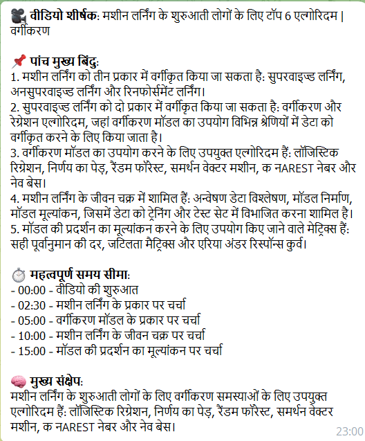
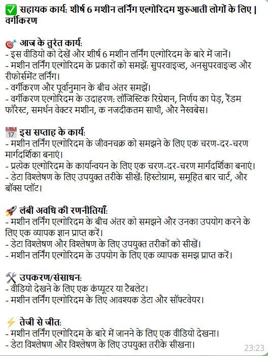

# 🎬 YouTube AI Summarizer & Q&A Bot

> A Telegram bot that summarizes YouTube videos, answers questions about them, and supports multiple Indian languages — powered by OpenClaw + Groq (Llama 3).

---

## 🚀 Demo Flow

| Step | User Action | Bot Response |
|------|-------------|--------------|
| 1 | Send YouTube link | 🎥 Structured summary with key points, timestamps, takeaway |
| 2 | Ask a question | 💬 Grounded answer from transcript |
| 3 | "Summarize in Hindi" | 🌐 Hindi response |
| 4 | `/actionpoints` | ✅ Actionable takeaways extracted |

---

## ✨ Features

- **Structured Summaries** — Key points, timestamps, core takeaway
- **Contextual Q&A** — Strictly grounded in transcript, no hallucinations
- **Multi-language** — English, Hindi, Kannada, Tamil, Telugu, Marathi
- **Smart Caching** — Transcripts cached per video ID
- **Long Video Support** — Map-reduce summarization for long transcripts
- **Session Management** — Per-user context with Q&A history
- **Bonus Commands** — `/deepdive`, `/actionpoints`, `/languages`
- **OpenClaw Integration** — Routes through local OpenClaw gateway

---

## 🛠️ Setup

### Prerequisites
- Python 3.11+
- Node.js 22+ (for OpenClaw)
- A Telegram Bot Token (from [@BotFather](https://t.me/BotFather))
- A Groq API key ([console.groq.com/keys](https://console.groq.com/keys))

### 1. Clone & Install

```bash
cd telegram_bot
pip install -r requirements.txt
```

### 2. Configure Environment

```bash
cp .env.example .env
```

Edit `.env`:
```env
TELEGRAM_BOT_TOKEN=your_telegram_bot_token
GROQ_API_KEY=your_groq_api_key
GROQ_QUALITY_MODEL=llama-3.3-70b-versatile
GROQ_FAST_MODEL=llama-3.1-8b-instant
```

### 3. Install OpenClaw (Local AI Gateway)

**Windows (PowerShell):**
```powershell
iwr -useb https://openclaw.ai/install.ps1 | iex
```

**macOS/Linux:**
```bash
curl -fsSL https://openclaw.ai/install.sh | bash
```

**Run the onboarding wizard:**
```bash
openclaw onboard --install-daemon
```

During onboarding, select:
- **Model**: Groq → enter your API key
- **Channel**: Telegram → enter your bot token

**Start the Gateway:**
```bash
openclaw gateway --port 18789
```

### 4. Create Telegram Bot

1. Open Telegram → search for **@BotFather**
2. Send `/newbot`
3. Choose a name and username
4. Copy the token → paste into `.env`

### 5. Run the Bot

Ensure you are in the project root (`telegram_bot`), then run:

```bash
python -m bot.main
```

---

## 📁 Project Structure

```
telegram_bot/
├── bot/
│   ├── main.py                    # Entry point, handler registration
│   └── handlers/
│       ├── link_handler.py        # YouTube URL → summary flow
│       ├── qa_handler.py          # Follow-up questions
│       └── command_handlers.py    # /start /help /summary /deepdive /actionpoints /language
├── services/
│   ├── transcript.py              # YouTube transcript fetching
│   ├── summarizer.py              # LLM summarization (map-reduce)
│   ├── qa.py                      # Grounded Q&A engine
│   └── language.py                # Language detection & translation
├── storage/
│   └── session_store.py           # In-memory session + transcript cache
├── openclaw/
│   └── skill.md                   # OpenClaw skill definition
├── tests/
│   ├── test_transcript.py
│   ├── test_summarizer.py
│   ├── test_qa.py
│   └── test_session_store.py
├── .env.example
├── requirements.txt
├── pytest.ini
└── README.md
```

---

## 🏗️ Architecture

```
User (Telegram)
       │
       ▼
OpenClaw Gateway (:18789)  ←——→  Telegram Bot API
       │
       ▼
Python Bot (python-telegram-bot v21)
       │
       ├──[YouTube URL]──► TranscriptService
       │                        │ youtube-transcript-api
       │                        ▼
       │                   TranscriptResult
       │                   (video_id, title, chunks)
       │                        │
       │                        ▼
       │                   SummarizerService
       │                   ┌─── Single chunk → direct summary
       │                   └─── Multi chunk → map-reduce
       │                        (Groq Llama 3)
       │
       ├──[Question]───► QAService
       │                   keyword-based excerpt selection
       │                   + Q&A history injection
       │                   → grounded answer
       │
       ├──[Language req]► LanguageService
       │                   regex detection + GPT translation
       │
       └──[Session]─────► SessionStore (in-memory)
                           per-user: transcript, summary,
                           language, qa_history (last 10)
                           shared: transcript cache by video_id
```

---

## 🎯 Design Trade-offs

| Decision | Chosen Approach | Alternative | Reason |
|----------|----------------|-------------|--------|
| **Transcript API** | `youtube-transcript-api` | YouTube Data API v3 | No API key required, simpler |
| **LLM** | Groq (Llama 3) | OpenAI / Claude | Ultra-fast inference, high quality capabilities |
| **Long video handling** | Map-reduce summarization | Chunked embedding search | Simpler, no vector DB needed |
| **Q&A context** | Keyword overlap + last 10 turns | Full RAG pipeline | Balances accuracy vs. complexity |
| **Session storage** | In-memory dict | Redis / SQLite | Zero setup, sufficient for single-instance |
| **Translation** | Llama 3 translation layer | Dedicated translation API | Unified LLM call, supports nuanced text |
| **OpenClaw role** | Gateway / channel connector | Full agent orchestrator | Python bot handles business logic directly |

---

## 🧪 Running Tests

```bash
python -m pytest tests/ -v
```

Expected output:
```
tests/test_session_store.py::TestSessionStore::test_create_new_session PASSED
tests/test_session_store.py::TestSessionStore::test_transcript_cache PASSED
tests/test_transcript.py::TestTranscriptService::test_extract_standard_url PASSED
tests/test_transcript.py::TestTranscriptService::test_invalid_url_raises PASSED
tests/test_summarizer.py::TestSummarizerService::test_summarize_single_chunk PASSED
tests/test_qa.py::TestQAService::test_answer_not_in_transcript PASSED
... (all tests pass)
```

---

## 💬 Bot Commands

| Command | Description |
|---------|-------------|
| `/start` | Welcome message & quick start |
| `/help` | Full usage guide |
| `/summary` | Re-send last video summary |
| `/deepdive` | In-depth video analysis |
| `/actionpoints` | Extract actionable steps |
| `/language <name>` | Switch language (e.g. `/language hindi`) |
| `/languages` | List all supported languages |

---

## 🌐 Supported Languages

| Language | Code | Example Request |
|----------|------|----------------|
| English | `en` | Default |
| Hindi | `hi` | `Summarize in Hindi` or `/language hindi` |
| Kannada | `kn` | `Explain in Kannada` |
| Tamil | `ta` | `/language tamil` |
| Telugu | `te` | `Reply in Telugu` |
| Marathi | `mr` | `/language marathi` |

---

## ⚠️ Edge Case Handling

| Case | Behavior |
|------|----------|
| Invalid YouTube URL | ❌ Clear error message |
| Video has no transcript | ❌ `TranscriptDisabledError` message |
| Video is private/deleted | ❌ `VideoUnavailable` message |
| Very long video (>1hr) | ✅ Map-reduce summarization |
| No video loaded (question first) | 📎 Prompt to send a link first |
| Question not in transcript | ❌ "This topic is not covered in the video." |
| Rate limit from Groq | ⚠️ Retries with error fallback |

---

## 📸 Screenshots

**1. Summary Response:**


**2. Q&A in Hindi:**


**3. Action Points:**


---

## 🔑 OpenClaw Configuration

After installing OpenClaw, configure `~/.openclaw/openclaw.json`:

```json
{
  "model": {
    "provider": "groq",
    "name": "llama-3.3-70b-versatile",
    "apiKey": "YOUR_GROQ_API_KEY"
  },
  "channels": {
    "telegram": {
      "token": "YOUR_TELEGRAM_BOT_TOKEN"
    }
  }
}
```

Start OpenClaw gateway:
```bash
openclaw gateway --port 18789 --verbose
```

Verify Telegram channel:
```bash
openclaw gateway status
openclaw channels login
```

---

## 📦 Dependencies

| Package | Version | Purpose |
|---------|---------|---------|
| `python-telegram-bot` | 21.6 | Telegram bot framework |
| `youtube-transcript-api` | 0.6.3 | YouTube transcript fetching |
| `groq` | 0.11.0 | Fast LLM API client |
| `python-dotenv` | 1.0.1 | Environment variable loading |
| `aiohttp` | 3.10.5 | Async HTTP client |
| `langdetect` | 1.0.9 | Language detection utility |
| `pytest` | 8.3.3 | Testing framework |

---

## Author

Built as part of the Eywa SDE Internship assignment — Telegram YouTube Summarizer & Q&A Bot using OpenClaw.
